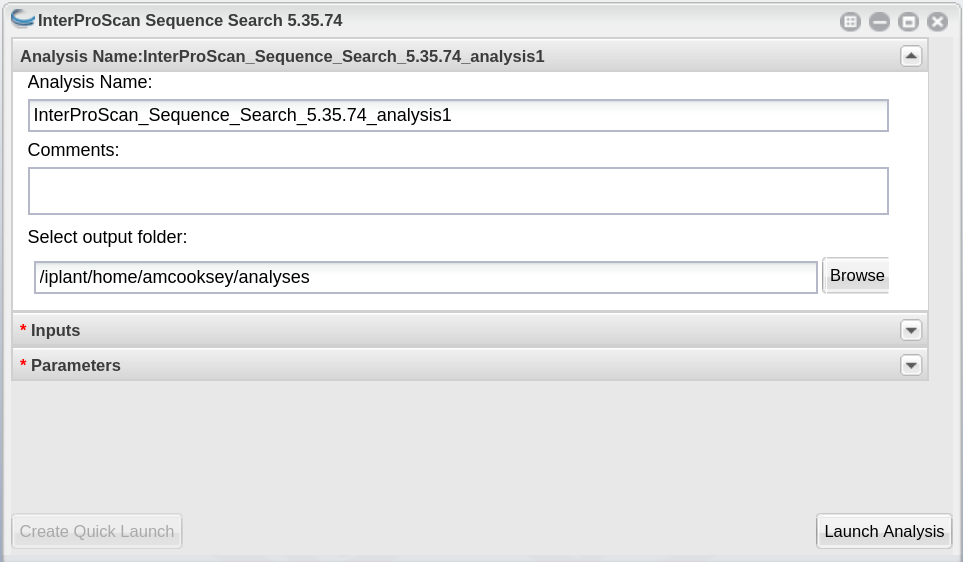

=========
**Intro**
=========

`InterPro <http://www.ebi.ac.uk/interpro/>`_ is a database which integrates together predictive information about proteins' function from a number of partner resources, giving an overview of the families that a protein belongs to and the domains and sites it contains.

**Basic functions of this tool**

- removes special characters from FASTA sequences
- splits FASTA into groups of 1000 sequences
- runs InterProScan with user-specified options on each of the 1000-sequence files in parallel
- re-combines output files from all groups of 1000
- parses the XML output from InterProScan to generate a gene association file (GAF) (and several other files)

Results and analysis from the application of InterProScan annotation to the Official gene set v3.0 protein set from *Diaphorina citri* followed by a differential expression analysis was presented at a seminar in the University of Arizona Animal and Comparative Biomedical Sciences in Fall 2020. The `slides <https://www.slideshare.net/suryasaha/functional-annotation-of-invertebrate-genomes>`_ and `video <https://arizona.zoom.us/rec/play/tZZ-fuutrj43T9fBtASDAaR9W9S0fP6s1XQbrvQOz0e0VnYHYVL1MOMaZ-F4v45qOmXQkV1MUXQ7tufD>`_ are available online.

.. NOTE::

    This tool accepts a peptide FASTA file. For those users with nucloetide sequences some documentation has been provided for using **TransDecoder** (although other tools are also acceptable).
    The `TransDecoder app <https://de.cyverse.org/de/?type=apps&app-id=74828a18-f351-11e8-be2b-008cfa5ae621&system-id=de>`_ is available through CyVerse or as a `BioContainer <https://quay.io/repository/biocontainers/transdecoder?tab=tags>`_ for use on the command line.

.. NOTE::

    As both GOanna and InterProScan provide GO annotations, their outputs are provided in GAF format. The **'Combine GAFs'** tool can then be used to make a single GAF of GO annotations, if desired.

**Where to Find InterProScan**
==============================

`Docker Hub (5.75-106) <https://hub.docker.com/r/agbase/interproscan>`_

`CyVerse (5.36-75) <https://de.cyverse.org/de/?type=apps&app-id=Interproscan-5.36.75u2&system-id=agave>`_

.. _iprsusage:

**Help and Usage Statement**
============================

.. _iprsusage:

.. code-block:: bash

    Options:
 -a  <ANALYSES>                             Optional, comma separated list of analyses.  If this option
                                            is not set, ALL analyses will be run.

 -b <OUTPUT-FILE-BASE>                     Optional, base output filename (relative or absolute path).
                                            Note that this option, the output directory (-d) option and
                                            the output file name (-o) option are mutually exclusive.  The
                                            appropriate file extension for the output format(s) will be
                                            appended automatically. By default the input file
                                            path/name will be used.

 -d <OUTPUT-DIR>                            Optional, output directory. Note that this option, the
                                            output file name (-o) option and the output file base (-b) option
                                            are mutually exclusive. The output filename(s) are the
                                            same as the input filename, with the appropriate file
                                            extension(s) for the output format(s) appended automatically .

 -c                                         Optional.  Disables use of the precalculated match lookup
                                            service.  All match calculations will be run locally.

 -C                                         Optional. Supply the number of cpus to use.

 -e                                         Optional, excludes sites from the XML, JSON output

 -f <OUTPUT-FORMATS>                        Optional, case-insensitive, comma separated list of output
                                            formats. Supported formats are TSV, XML, JSON, GFF3, HTML and
                                            SVG. Default for protein sequences are TSV, XML and
                                            GFF3, or for nucleotide sequences GFF3 and XML.

 -g                                         Optional, switch on lookup of corresponding Gene Ontology
                                            annotation (IMPLIES -l lookup option)

 -h                                         Optional, display help information

 -i <INPUT-FILE-PATH>                       Optional, path to fasta file that should be loaded on
                                            Master startup. Alternatively, in CONVERT mode, the
                                            InterProScan 5 XML file to convert.

 -l                                         Also include lookup of corresponding InterPro
                                            annotation in the TSV and GFF3 output formats.

 -m <MINIMUM-SIZE>                          Optional, minimum nucleotide size of ORF to report. Will
                                            only be considered if n is specified as a sequence type.
                                            Please be aware of the fact that if you specify a too
                                            short value it might be that the analysis takes a very long
                                            time!

 -p                                         Optional, switch on lookup of corresponding Pathway
                                            annotation (IMPLIES -l lookup option)
 -t <SEQUENCE-TYPE>                         Optional, the type of the input sequences (dna/rna (n)
                                            or protein (p)).  The default sequence type is protein.

 -T <TEMP-DIR>                              Optional, specify temporary file directory (relative or
                                            absolute path). The default location is temp/.

 -v                                         Optional, display version number

 -r                                          Optional. 'Mode' required ( -r 'cluster') to run in cluster mode. These options
                                            are provided but have not been tested with this wrapper script. For
                                            more information on running InterProScan in cluster mode:
                                            https://github.com/ebi-pf-team/interproscan/wiki/ClusterMode

 -R                                          Optional. Clusterrunid (crid) required when using cluster mode.
                                            -R unique_id

Available InterProScan analyses:

- CDD
- COILS
- Gene3D
- HAMAP
- MOBIDB
- PANTHER
- Pfam
- PIRSF
- PRINTS
- PROSITE (Profiles and Patterns)
- SFLD
- SMART (unlicensed components only by default - this analysis has simplified post-processing that includes an E-value filter, however you should not expect it to give the same match output as the fully licensed version of SMART)
- SUPERFAMILY
- NCBIFAM (includes the previous TIGRFAM analysis)

 OPTIONS FOR XML PARSER OUTPUTS

 -F <IPRS output directory>              This is the output directory from InterProScan.
 -D <database>                           Supply the database responsible for these annotations.
 -x <taxon>                              NCBI taxon ID of the ID being annotated
 -y <type>                               Transcript or protein
 -n <biocurator>                         Name of the biocurator who made these annotations
 -M <mapping file>                       Optional. Mapping file.
 -B <bad seq file>                       Optional. Bad input sequence file.
============================================
**InterProScan on the Command Line**
============================================

**Getting the InterProScan Data (now including PANTHER)**
==========================================================
.. code-block:: bash

    wget ftp://ftp.ebi.ac.uk/pub/software/unix/iprscan/5/5.75-106.0/alt/interproscan-data-5.75-106.0.tar.gz
    wget ftp://ftp.ebi.ac.uk/pub/software/unix/iprscan/5/5.75-106.0/alt/interproscan-data-5.75-106.0.tar.gz.md5
    md5sum -c interproscan-data-5.75-106.0.tar.gz.md
    tar -pxvzf interproscan-data-5.75-106.0.tar.gz

.. admonition:: tar options

   - p = preserve the file permissions
   - x = extract files from an archive
   - v = verbosely list the files processed
   - z = filter the archive through gzip
   - f = use archive file

**Container Technologies**
==========================
Interproscan is provided as a Docker container.

A container is a standard unit of software that packages up code and all its dependencies so the application runs quickly and reliably from one computing environment to another.

There are two major containerization technologies: **Docker** and **Apptainer**.

Docker containers can be run with either technology.

**Running InterProScan using Docker**
=====================================

.. admonition:: About Docker

    - Docker must be installed on the computer you wish to use for your analysis.
    - To run Docker you must have ‘root’ permissions (or use sudo).
    - Docker will run all containers as ‘root’. This makes Docker incompatible with HPC systems (see Apptainer below).
    - Docker can be run on your local computer, a server, a cloud virtual machine etc.
    - For more information on installing Docker on other systems see this tutorial:  `Installing Docker on your machine <https://docs.docker.com/engine/install/>`_.

.. Important::

    We have included this basic documentation for running InterProScan with Docker. However, InterProScan requires quite a lot of compute resources and may need to be run on an HPC system. If you need to use HPC see 'Apptainer' below.

**Getting the InterProScan Container**
---------------------------------------
The InterProScan tool is available as a Docker container on Docker Hub where you can see all the available versions:
`InterProScan container <https://hub.docker.com/r/agbase/interproscan>`_

The latest container can be pulled with this command:

.. code-block:: bash

    docker pull agbase/interproscan:5.75-106

.. admonition:: Remember

    You must have root permissions or use sudo, like so:

    sudo docker pull agbase/interproscan:5.75-106

**Running InterProScan with Data**
----------------------------------
.. tip::

    There is one directory built into this container. This directory should be used to mount your working directory.

    - /data

**Getting the Help and Usage Statement**
^^^^^^^^^^^^^^^^^^^^^^^^^^^^^^^^^^^^^^^^

.. code-block:: bash

    sudo docker run --rm -v $(pwd):/work-dir agbase/interproscan:5.75-106 -h

See :ref:`iprsusage`

**Example Command**
^^^^^^^^^^^^^^^^^^^

.. code-block:: bash

    sudo docker run \
    -v /your/local/data/directory:/data \
    -v /where/you/downloaded/interproscan/data/interproscan-5.75-106.0/data:/opt/interproscan/data \
    agbase/interproscan:5.75-106 \
    -i /path/to/your/input/file/pnnl_10000.fasta \
    -d outdir_10000 \
    -f tsv,json,xml,gff3 \
    -g \
    -p \
    -c \
    -n curator \
    -x 109069 \
    -D database \
    -l

**Command Explained**
""""""""""""""""""""""""

**sudo docker run:** tells docker to run

**--rm:** removes container when analysis finishes (image will remain for furture analyses)

**-v /your/local/data/directory:/data:** mount my working directory on the host machine into the /data directory in the container. The syntax for this is <absolute path on host machine>:<absolute path in container>

**-v /where/you/downloaded/interproscan/data/interproscan-5.75-106.0/data:/opt/interproscan/data:** mounts the InterProScan partner data (downloaded from FTP) on the host machine into the /opt/interproscan/data directory in the container

**agbase/interproscan:5.75-106:** the name of the Docker image to use

.. tip::

    All the options supplied after the image name are Interproscan options

**-i /path/to/your/input/file/pnnl_10000.fasta:** local path to input FASTA file. You can also use the mounted file path: /data/pnnl_10000.fasta

**-d outdir_10000:** output directory name

**-f tsv,json,xml,gff3:** desired output file formats

**-g:** tells the tool to perform GO annotation

**-p:** tells tool to perform pathway annotation

**-c:** tells tool to perform local compute and not connect to EBI. This only adds a little to the run time but removes error messages from network time out errors

**-n curator:** name of biocurator to include in column 15 of GAF output file

**-x 109069:** taxon ID of query species to be used in column 13 of GAF output file

**-D database:** database of query accession to be used in column 1 of GAF output file

**-l:** tells tools to include lookup of corresponding InterPro annotation in the TSV and GFF3 output formats.

**Understanding Your Results**
^^^^^^^^^^^^^^^^^^^^^^^^^^^^^^
**InterProScan outputs:** https://github.com/ebi-pf-team/interproscan/wiki/OutputFormats
""""""""""""""""""""""""""""""""""""""""""""""""""""""""""""""""""""""""""""""""""""""""

- <basename>.gff3
- <basename>.tsv
- <basename>.xml
- <basename>.json

**Parser Outputs**
""""""""""""""""""
**<basename>_gaf.txt:**
-This table follows the formatting of a gene association file (gaf) and can be used in GO enrichment analyses.

**<basename>_acc_go_counts.txt:**
-This table includes input accessions, the number of GO IDs assigned to each accession and GO ID names. GO IDs are split into BP (Biological Process), MF (Molecular Function) and CC (Cellular Component).

**<basename>_go_counts.txt:**
-This table counts the numbers of sequences assigned to each GO ID so that the user can quickly identify all genes assigned to a particular function.

**<basename>_acc_interpro_counts.txt:**
-This table includes input accessions, number of InterPro IDs for each accession, InterPro IDs assigned to each sequence and the InterPro ID name.

**<basename>_interpro_counts.txt:**
-This table counts the numbers of sequences assigned to each InterPro ID so that the user can quickly identify all genes with a particular motif.

**<basename>_acc_pathway_counts.txt:**
-This table includes input accessions, number of pathway IDs for the accession and the pathway names. Multiple values are separated by a semi-colon.

**<basename>_pathway_counts.txt:**
-This table counts the numbers of sequences assigned to each Pathway ID so that the user can quickly identify all genes assigned to a pathway.

**<basename>.err:**
-This file will list any sequences that were not able to be analyzed by InterProScan. Examples of sequences that will cause an error are sequences with a large run of Xs.

If you see more files in your output folder there may have been an error in the analysis or there may have been no GO to transfer. `Contact us <agbase@email.arizona.edu>`_.

**Running InterProScan with Apptainer on HPC**
===============================================================
.. admonition:: About Apptainer

    - does not require ‘root’ permissions
    - runs all containers as the user that is logged into the host machine
    - HPC systems are likely to have Apptainer installed and are unlikely to object if asked to install it (no guarantees).
    - can be run on any machine where is is installed
    - more information about `Apptainer <https://apptainer.org/user-docs/3.8/>`_ and `Apptainer <https://apptainer.org/docs/user/latest/>`_
    - This tool was tested using Apptainer 3.11.4

.. admonition:: HPC Job Schedulers

    Although Apptainer can be installed on any computer this documentation assumes it will be run on an HPC system. The tool was tested on a SLURM system and the job submission scripts below reflect that. Submission scripts will need to be modified for use with other job scheduler systems.

**Getting the InterProScan Container**
--------------------------------------

The InterProScan tool is available as a Docker container on Docker Hub:
`InterProScan container <https://hub.docker.com/r/agbase/interproscan>`_

The container can be pulled with this command:

.. code-block:: bash

    apptainer pull docker://agbase/interproscan:5.75.106

**Getting the Help and Usage Statement**
^^^^^^^^^^^^^^^^^^^^^^^^^^^^^^^^^^^^^^^^
**Example SLURM script:**

.. code-block:: bash

    #!/bin/bash
    #SBATCH --job-name=jobname
    #SBATCH --ntasks=48
    #SBATCH --nodes=1
    #SBATCH --mem=0
    #SBATCH --time=48:00:00
    #SBATCH --partition=ceres
    #SBATCH --account=nal_genomics

    module load apptainer

    apptainer run \
    interproscan_5.75-106.sif \
    -h

See :ref:`iprsusage`

**Running InterProScan with Data**
----------------------------------

.. tip::

    There is one directory built into this container. This directory should be used to mount your working directory.

    - /data

**Example SLURM Script**
^^^^^^^^^^^^^^^^^^^^^^^^

.. code-block:: bash

    #!/bin/bash
    #SBATCH --job-name=jobname
    #SBATCH --ntasks=48
    #SBATCH --nodes=1
    #SBATCH --mem=0
    #SBATCH --time=48:00:00
    #SBATCH --partition=ceres
    #SBATCH --account=nal_genomics

    module load apptainer

    apptainer run \
    -B /your/local/data/directory:/data \
    -B /where/you/downloaded/interproscan/data/interproscan-5.75-106.0/data:/opt/interproscan/data \
    interproscan_5.75-106.sif \
    -i /your/local/data/directory/pnnl_10000.fasta \
    -d outdir_10000 \
    -f tsv,json,xml,gff3 \
    -g \
    -p \
    -c \
    -n biocurator \
    -x 109069 \
    -D database \
    -l

**Command Explained**
""""""""""""""""""""""""

**apptainer run:** tells Apptainer to run

**-B /your/local/data/directory:/data:** mounts my working directory on the host machine into the /data directory in the container the syntax for this is <aboslute path on host machine>:<aboslute path in container>

**-B /where/you/downloaded/interproscan/data/interproscan-5.75-106.0/data:/opt/interproscan/data:** mounts he InterProScan data directory that was downloaded from the FTP site into the InterProScan data directory in the container

**interproscan_5.75-106.sif:** name of the image to use

.. tip::

    All the options supplied after the image name are options for this tool

**-i /your/local/data/directory/pnnl_10000.fasta:** input FASTA file

**-d outdir_10000:** output directory name

**-f tsv,json,xml,gff3:** desired output file formats

**-g:** tells the tool to perform GO annotation

**-c:** tells tool to perform local compute and not connect to EBI. This only adds a little to the run time but removes error messages from network time out errors

**-p:** tells tool to perform pathway annoation

**-n biocurator:** name of biocurator to include in column 15 of GAF output file

**-x 109069:** taxon ID of query species to be used in column 13 of GAF output file

**-D database:** database of query accession to be used in column 1 of GAF output file

**-l:** tells tools to include lookup of corresponding InterPro annotation in the TSV and GFF3 output formats.

**Understanding Your Results**
^^^^^^^^^^^^^^^^^^^^^^^^^^^^^^
**InterProScan outputs:** https://github.com/ebi-pf-team/interproscan/wiki/OutputFormats
""""""""""""""""""""""""""""""""""""""""""""""""""""""""""""""""""""""""""""""""""""""""

- <basename>.gff3
- <basename>.tsv
- <basename>.xml
- <basename>.json

**Parser Outputs**
""""""""""""""""""
**<basename>_gaf.txt:**
-This table follows the formatting of a gene association file (gaf) and can be used in GO enrichment analyses.

**<basename>_acc_go_counts.txt:**
-This table includes input accessions, the number of GO IDs assigned to each accession and GO ID names. GO IDs are split into BP (Biological Process), MF (Molecular Function) and CC (Cellular Component).

**<basename>_go_counts.txt:**
-This table counts the numbers of sequences assigned to each GO ID so that the user can quickly identify all genes assigned to a particular function.

**<basename>_acc_interpro_counts.txt:**
-This table includes input accessions, number of InterPro IDs for each accession, InterPro IDs assigned to each sequence and the InterPro ID name.

**<basename>_interpro_counts.txt:**
-This table counts the numbers of sequences assigned to each InterPro ID so that the user can quickly identify all genes with a particular motif.

**<basename>_acc_pathway_counts.txt:**
-This table includes input accessions, number of pathway IDs for the accession and the pathway names. Multiple values are separated by a semi-colon.

**<basename>_pathway_counts.txt:**
-This table counts the numbers of sequences assigned to each Pathway ID so that the user can quickly identify all genes assigned to a pathway.

**<basename>.err:**
-This file will list any sequences that were not able to be analyzed by InterProScan. Examples of sequences that will cause an error are sequences with a large run of Xs.

If you see more files in your output folder there may have been an error in the analysis or there may have been no GO to transfer. `Contact us <agbase@email.arizona.edu>`_.
============================================
**InterProScan on the ARS Ceres HPC**
============================================

**About Ceres/Scinet**
===============================
- The Scinet VRSC has installed InterProScan for ARS use.
- For general information on Ceres/Scinet, how to access it, and how to use it, visit `https://usda-ars-gbru.github.io/scinet-site/ <https://usda-ars-gbru.github.io/scinet-site/>`_.

**Running InterProScan on Ceres/Scinet**
========================================

.. Important::

    - InterProScan requires quite a lot of compute resources and should be run in batch mode.
    - Before using batch mode, you should review Ceres/Scinet's documentation first, and decide what queue you'll want to use. See `https://usda-ars-gbru.github.io/scinet-site/guide/ceres/ <https://usda-ars-gbru.github.io/scinet-site/guide/ceres/>`_.

**Running InterProScan with Data**
----------------------------------

**Getting the Help and Usage Statement**
^^^^^^^^^^^^^^^^^^^^^^^^^^^^^^^^^^^^^^^^

.. code-block:: bash

    agbase_interproscan -h

See :ref:`iprsusage`

**Example batch job submission bash script (e.g. agbase_interproscan-job.sh):**
^^^^^^^^^^^^^^^^^^^^^^^^^^^^^^^^^^^^^^^^^^^^^^^^^^^^^^^^^^^^^^^^^^^^^^^^^^^^^^^

.. code-block:: bash

    #! /bin/bash
    module load agbase
    agbase_interproscan -i AROS_10.faa -d outdir -f tsv,json,xml,html,gff3,svg -g -p -n Monica -x 109069 -D i5k

**Submitting the batch job:**
^^^^^^^^^^^^^^^^^^^^^^^^^^^^^

.. code-block:: bash

    sbatch agbase_interproscan-job.sh

**Command Explained**
""""""""""""""""""""""""

**-i AROS_10.faa:** local path to input FASTA file.

**-d outdir:** output directory name

**-f tsv,json,xml,html,gff3,svg:** desired output file formats

**-g:** tells the tool to perform GO annotation

**-p:** tells tool to perform pathway annoation

**-n Monica:** name of biocurator to include in column 15 of GAF output file

**-x 109069:** taxon ID of query species to be used in column 13 of GAF output file

**-D i5k:** database of query accession to be used in column 1 of GAF output file

**Understanding Your Results**
^^^^^^^^^^^^^^^^^^^^^^^^^^^^^^
**InterProScan outputs:** https://github.com/ebi-pf-team/interproscan/wiki/OutputFormats
""""""""""""""""""""""""""""""""""""""""""""""""""""""""""""""""""""""""""""""""""""""""

**Default**
- <basename>.gff3
- <basename>.tsv
- <basename>.xml

**Optional**
- <basename>.json
- <basename>.html.tar.gz
- <basename>.svg.tar.gz

**Parser Outputs**
""""""""""""""""""
**<basename>_gaf.txt:**
-This table follows the formatting of a gene association file (gaf) and can be used in GO enrichment analyses.

**<basename>_acc_go_counts.txt:**
-This table includes input accessions, the number of GO IDs assigned to each accession and GO ID names. GO IDs are split into BP (Biological Process), MF (Molecular Function) and CC (Cellular Component).

**<basename>_go_counts.txt:**
-This table counts the numbers of sequences assigned to each GO ID so that the user can quickly identify all genes assigned to a particular function.

**<basename>_acc_interpro_counts.txt:**
-This table includes input accessions, number of InterPro IDs for each accession, InterPro IDs assigned to each sequence and the InterPro ID name.

**<basename>_interpro_counts.txt:**
-This table counts the numbers of sequences assigned to each InterPro ID so that the user can quickly identify all genes with a particular motif.

**<basename>_acc_pathway_counts.txt:**
-This table includes input accessions, number of pathway IDs for the accession and the pathway names. Multiple values are separated by a semi-colon.

**<basename>_pathway_counts.txt:**
-This table counts the numbers of sequences assigned to each Pathway ID so that the user can quickly identify all genes assigned to a pathway.

**<basename>.err:**
-This file will list any sequences that were not able to be analyzed by InterProScan. Examples of sequences that will cause an error are sequences with a large run of Xs.

If you see more files in your output folder there may have been an error in the analysis or there may have been no GO to transfer. `Contact us <agbase@email.arizona.edu>`_.
===========================
**InterProScan on CyVerse**
===========================

**Accessing InterProScan in the Discovery Environment**
========================================================

1. `Create an account on CyVerse <user.cyverse.org>`_ (free)
2. Open the CyVerse Discovery Environment (DE) and login with your CyVerse credentials.
3. If you are new to the Discovery Environment (DE) the user guide can be found `here <https://learning.cyverse.org/projects/discovery-environment-guide/en/latest/>`_.

4. Click on the ‘Data’ button at the left side of the screen to access your files/folders. Upload your data to the DE.
5. To access the `InterProScan Sequence Search 5.36-75.0 <https://de.cyverse.org/de/?type=apps&app-id=Interproscan-5.36.75u3&system-id=agave>`_ app click on the ‘Apps’ button at the left side of the DE. 
6. Search for 'interproscan' in the search bar at the top of the ‘apps’ window. The contents of the folder will appear in the main pane of the window. The InterProScan app is called ‘InterProScan Sequence Search 5.36-75’; click on the name to open the app.

**Using the InterProScan App**
==============================
**Launching the App**
---------------------

|iprs|

**InterProScan_Sequence_Search_5.36.75_analysis1:**
This menu is used to name the job you will run so that you can find it later.
Analysis Name: The default name is "InterProScan_Sequence_Search_5.36.75_analysis1". We recommend changing the 'analysis1' portion of this to reflect the data you are running.

**Comments:**
(Optional) You can add additional information in the comments section to distinguish your analyses further.

**Select output folder:**
This is where your results will be placed. The default (recommended) is your 'analyses' folder.

**Retain Inputs:**
Enabling this flag will copy all the input files into the analysis result folder. 

.. WARNING::

    Selecting this option will rapidly consume your allocated space. It is not recommended. Your inputs will always remain available in the folder in which you stored them.

**Input**
^^^^^^^^^

**Peptide FASTA file:** Use the Browse button on the right hand side to navigate to your Data folder and select your protein sequence file. 

**Parameters**
^^^^^^^^^^^^^^

**Annotate each peptide with Gene Ontology information:** Be sure this box is checked. This will ensure that you get GO annotations

**Biocurator:** This will be used to fill the 'assigned by' field of your GAF output file. If you do not fill it in the default "user" will be used instead.

**Database:** Use the database that sequences were obtained from (Genbank), or a recognizable project name if these sequences are not in a database (e.g., i5k project or Smith Lab).

**Annotate each peptide with biological pathway information:** This is optional. However, if you want pathways annotations be it is checked.

**Taxon:** Enter the NCBI taxon number for your species. This can be found by searching for your species name (common or scientific) in the `NCBI taxon database <https://www.ncbi.nlm.nih.gov/taxonomy>`_. 

**InterProScan output directory name:** This will be the name of the folder for your output files. The default folder name is 'outdir'.

**Understanding Your Results**
==============================
**InterProScan Outputs**
------------------------
This app provides all six of the InterProScan output formats. For more details on the contents of each file please refer to the InterProScan `outputs documentation <https://github.com/ebi-pf-team/interproscan/wiki/OutputFormats>`_.

**<basename>.gff3**

**<basename>.tsv**

**<basename>.xml**

**<basename>.json**

**<basename>.html.tar.gz**

**<basename>.svg.tar.gz**

This app also runs the 'InterProScan Results Function' on the XML output from InterProScan. This tool provides a GAF output file and a variety of summary (count) files described below.

**InterProScan Results Function Outputs**
------------------------------------------
**<basename>_gaf.txt:**
-This table follows the formatting of a gene association file (gaf) and can be used in GO enrichment analyses.
 
**<basename>_acc_go_counts.txt:**
-This table includes input accessions, the number of GO IDs assigned to each accession and GO ID names. GO IDs are split into BP (Biological Process), MF (Molecular Function) and CC (Cellular Component).

**<basename>_go_counts.txt:**
-This table counts the numbers of sequences assigned to each GO ID so that the user can quickly identify all genes assigned to a particular function.

**<basename>_acc_interpro_counts.txt:**
-This table includes input accessions, number of InterPro IDs for each accession, InterPro IDs assigned to each sequence and the InterPro ID name.

**<basename>_interpro_counts.txt:**
-This table counts the numbers of sequences assigned to each InterPro ID so that the user can quickly identify all genes with a particular motif. 

**<basename>_acc_pathway_counts.txt:**
-This table includes input accessions, number of pathway IDs for the accession and the pathway names. Multiple values are separated by a semi-colon.

**<basename>_pathway_counts.txt:**
-This table counts the numbers of sequences assigned to each Pathway ID so that the user can quickly identify all genes assigned to a pathway.

**<basename>.err:**
-This file will list any sequences that were not able to be analyzed by InterProScan. Examples of sequences that will cause an error are sequences with a large run of Xs.

If you output doesn't look like you expect please check the 'condor_stderr' file in the analysis output 'logs' folder. If that doesn't clarify the problem contact us at agbase@email.arizona.edu or support@cyverse.org.

